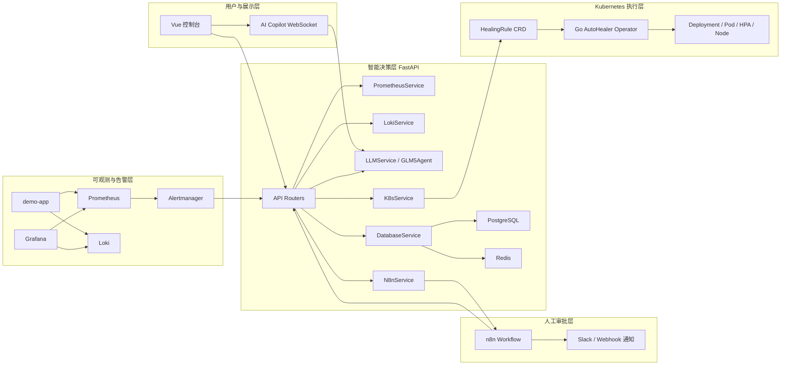
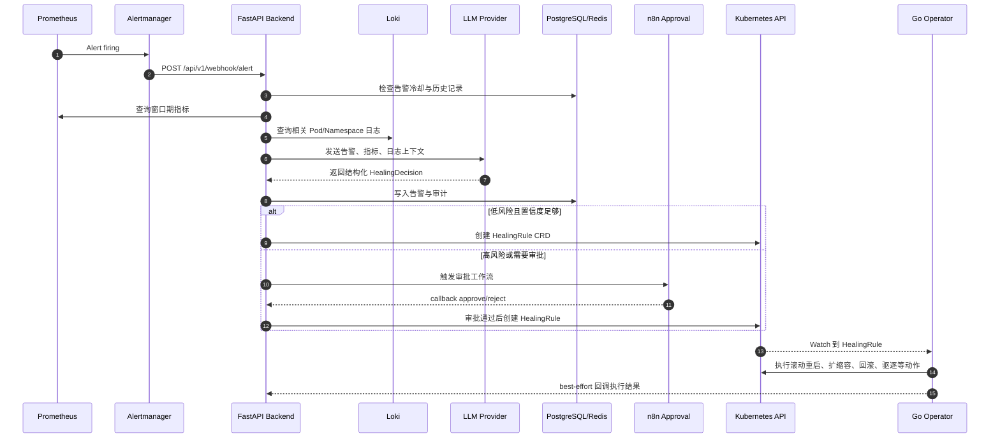
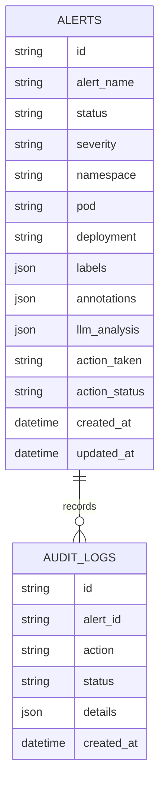

# KubeSentinel 架构说明与毕业设计材料

## 1. 项目定位

KubeSentinel 是一个面向 Kubernetes 场景的智能 AIOps 自愈平台。它把 Prometheus/Alertmanager 告警、Loki 日志、LLM 根因分析、n8n 人工审批、Go Operator 自愈执行、Vue 控制台展示串成一条闭环链路，用于演示从故障发现、智能诊断到自动或半自动修复的完整过程。

本项目的毕业设计价值不只是“调用大模型”，而是把大模型放在可解释、可审计、可回滚的工程边界里：LLM 负责分析和建议，后端负责安全门控与审计，Operator 负责 Kubernetes 原生执行，n8n 负责高风险动作的人机协同审批。

| 层级 | 目录 | 主要技术 | 职责 |
|---|---|---|---|
| 前端展示层 | `frontend-vue/` | Vue 3, Element Plus, ECharts, WebSocket | 展示告警、统计、审计日志和 AI Copilot |
| 智能决策层 | `backend-python/` | FastAPI, SQLAlchemy Async, Redis, LLM API, Kubernetes Python Client | 接收告警、聚合上下文、调用 LLM、落库、触发 CRD 或 n8n |
| 自愈执行层 | `operator-go/` | Go, controller-runtime, Kubernetes CRD | Watch `HealingRule` 并执行重启、扩缩容、回滚、驱逐等动作 |
| 工作流编排层 | `n8n/`, `n8n-workflows/` | n8n Webhook, Switch, Slack/HTTP Request | 对高风险动作做人工审批或消息通知 |
| 可观测层 | `k8s-manifests/monitoring/`, `docker/` | Prometheus, Alertmanager, Grafana, Loki | 采集指标、触发告警、可视化与日志查询 |
| 演示与验证层 | `k8s-manifests/demo-app/`, `scripts/`, `tests/` | K8s YAML, Shell, Python, Playwright | 部署靶机应用、注入故障、验证前端 |

## 2. 总体架构图

## 3. 告警自愈时序图

## 4. 核心模块理解

### 4.1 后端 `backend-python/`

- `main.py`：通过 FastAPI lifespan 初始化 Prometheus、Loki、LLM、通知、数据库、K8s 服务，并注册 `stats`、`health`、`alerts`、`ws`、`n8n` 等路由。
- `api/alerts.py`：系统主闭环入口，接收 Alertmanager webhook，处理冷却、指标日志聚合、LLM 决策、安全门控、CRD 创建和 n8n 审批。
- `api/n8n.py`：接收审批回调，通过 `X-KubeSentinel-Token` 做基本校验，批准后创建 `HealingRule`，拒绝后写审计。
- `services/llm_service.py`：封装 DashScope/OpenAI-compatible 调用，包含 JSON 提取、重试与安全 fallback。
- `services/db_service.py`：使用 PostgreSQL 存储 `alerts` 与 `audit_logs`，使用 Redis 做冷却和待审批缓存。
- `services/agent/glm5_agent.py`：面向 AI Copilot 的工具调用 Agent，可查日志、事件、PromQL 和异常检测。

### 4.2 Operator `operator-go/`

- `api/v1beta1/healingrule_types.go`：定义 `HealingRule` CRD 的 spec/status。
- `internal/controller/healingrule_controller.go`：监听 `HealingRule`，根据 action 执行 `rolling_restart`、`scale_up`、`scale_down`、`rollback`、`delete_pod`、`adjust_hpa`、`cordon_node`、`evict_pods` 等动作。
- `cmd/main.go`：启动 controller-runtime manager、注册 scheme、健康检查与控制器。本轮已适配 controller-runtime `v0.16.3` 的 metrics 配置写法。

### 4.3 前端 `frontend-vue/`

- `src/views/Dashboard.vue`：展示系统态势、统计卡片、图表和实时信息。
- `src/views/Alerts.vue`：展示告警列表、AI 分析结果与审批操作。
- `src/views/History.vue`：展示历史告警和审计信息。
- `src/components/AICopilot.vue`：通过 WebSocket 与后端 Agent 交互，用于演示自然语言排障。
- `src/api/kubesentinel.js`：封装后端 API 调用，默认指向 `http://localhost:8000/api/v1`。

### 4.4 监控、部署与工作流

- `k8s-manifests/monitoring/alerting-rules.yaml`：定义 Pod CPU、内存、重启、Ready、Deployment 副本不一致和 Node 压力等规则。
- `docker/alertmanager/alertmanager.yml`：将告警路由到后端 webhook。
- `docker-compose.yml`：编排 n8n、Prometheus、Grafana、后端、前端、Loki、Alertmanager、Redis 等本地组件。
- `n8n/kubesentinel_approval_workflow.json`：可解析的审批工作流，包含 Webhook、Switch、通知和回调。

## 5. 数据模型

## 6. 当前进展与开发记录

| 时间点 | 进展 | 说明 |
|---|---|---|
| 当前阶段 | 仓库阅读与架构梳理 | 已梳理前端、后端、Operator、监控、n8n 审批和脚本链路 |
| 当前阶段 | 答辩材料准备 | 已生成架构说明与 PPT，PPT 中补充“当前进展与开发记录”页 |
| 当前阶段 | Go Operator 修复 | 统一 Kubernetes 依赖并适配 controller-runtime metrics 配置，保证 `go test ./...` 可运行 |
| 下一阶段 | 租用服务器 | 准备租服务器搭建 Kubernetes 集群，完成真实部署环境验证 |
| 下一阶段 | 部署运行项目 | 计划部署 Prometheus、Alertmanager、Loki、后端、前端、n8n 与 Operator |
| 下一阶段 | 交付开发过程文档 | 准备整理环境搭建、部署步骤、问题记录、测试过程和答辩演示截图 |

## 7. 风险与改进建议

| 风险 | 影响 | 建议 |
|---|---|---|
| `n8n-workflows/main-healing-flow.json`、`notify-flow.json` 解析失败 | 旧工作流无法直接导入演示 | 以 `n8n/kubesentinel_approval_workflow.json` 为主，后续修复旧 JSON |
| 前端构建产物 chunk 偏大 | 首屏加载可能较慢 | 使用路由级动态导入和 ECharts 按需加载 |
| n8n Basic Auth 当前关闭 | 演示环境暴露时有风险 | 服务器部署时开启认证并配置 HTTPS |
| 本地演示与真实集群差异 | 毕设演示说服力不足 | 下一阶段租服务器部署真实 Kubernetes 集群并记录过程 |

## 8. 官方文档 Deep Link

- Kubernetes Custom Resources: <https://kubernetes.io/docs/concepts/extend-kubernetes/api-extension/custom-resources/>
- Kubernetes Operator pattern: <https://kubernetes.io/docs/concepts/extend-kubernetes/operator/>
- Kubernetes Probes: <https://kubernetes.io/docs/tasks/configure-pod-container/configure-liveness-readiness-startup-probes/>
- Prometheus Alerting Rules: <https://prometheus.io/docs/prometheus/latest/configuration/alerting_rules/>
- Alertmanager Configuration: <https://prometheus.io/docs/alerting/latest/configuration/>
- FastAPI Lifespan Events: <https://fastapi.tiangolo.com/advanced/events/>
- n8n Webhook Node: <https://docs.n8n.io/integrations/builtin/core-nodes/n8n-nodes-base.webhook/>
