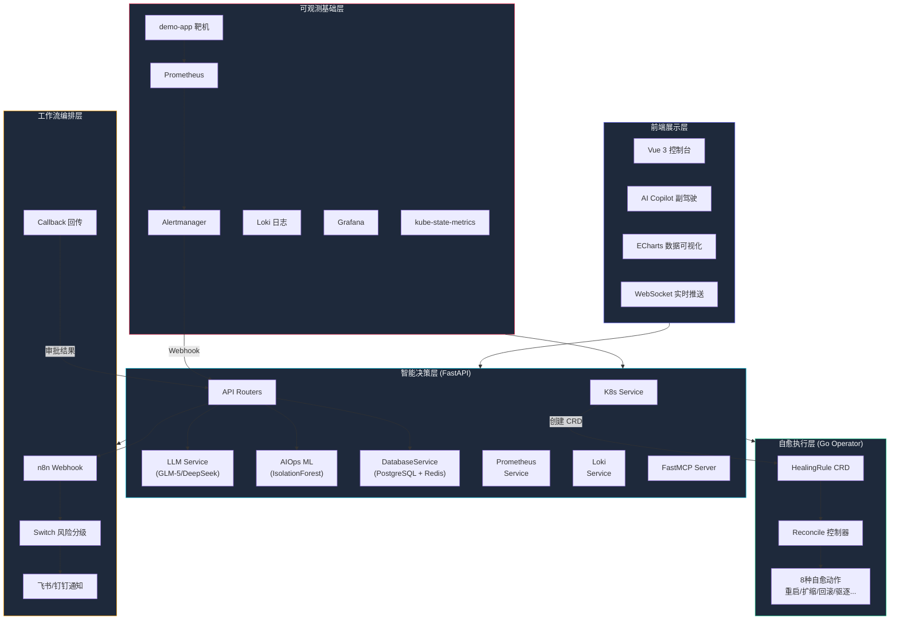
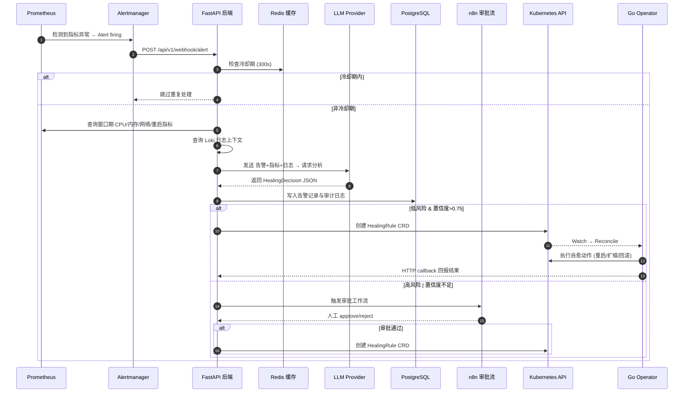
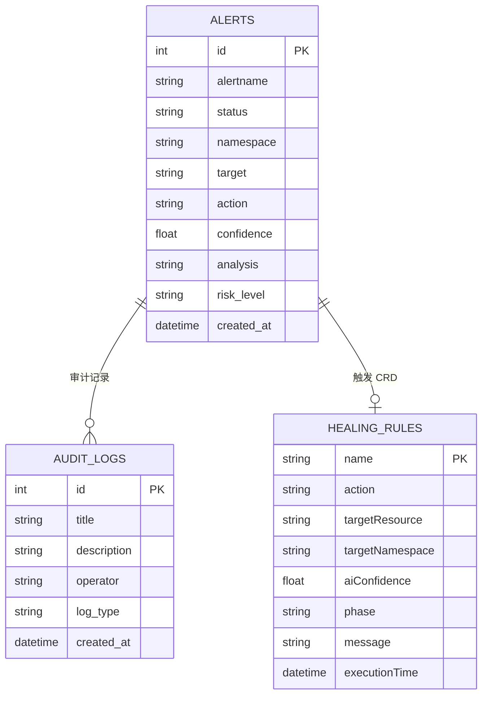

# KubeSentinel 毕业设计 — 架构分析与交付物

## 项目概述

**KubeSentinel** 是一个基于大语言模型的 Kubernetes 智能自愈与 AIOps 平台。核心使命是通过将 LLM 推理能力与 DAG 工作流编排深度融合，实现从"秒级异常发现"到"全自动修复闭环"的无人值守运维。

---

## 系统五层架构图

---

## 告警自愈时序图

---

## 数据模型

---

## 项目技术栈总览

| 层级 | 技术栈 | 核心文件 |
|---|---|---|
| **前端** | Vue 3 + Element Plus + ECharts + WebSocket | [Dashboard.vue](file:///c:/Users/liudeyu/my-project/kubenete-Aiops/frontend-vue/src/views/Dashboard.vue), [AICopilot.vue](file:///c:/Users/liudeyu/my-project/kubenete-Aiops/frontend-vue/src/components/AICopilot.vue) |
| **后端** | FastAPI + asyncpg + Redis + LLM API | [main.py](file:///c:/Users/liudeyu/my-project/kubenete-Aiops/backend-python/main.py), [alerts.py](file:///c:/Users/liudeyu/my-project/kubenete-Aiops/backend-python/api/alerts.py) |
| **AI 引擎** | GLM-5/DeepSeek + IsolationForest | [llm_service.py](file:///c:/Users/liudeyu/my-project/kubenete-Aiops/backend-python/services/llm_service.py), [aiops_service.py](file:///c:/Users/liudeyu/my-project/kubenete-Aiops/backend-python/services/aiops_service.py) |
| **Operator** | Go + Kubebuilder + controller-runtime | [healingrule_controller.go](file:///c:/Users/liudeyu/my-project/kubenete-Aiops/operator-go/internal/controller/healingrule_controller.go) |
| **CRD** | HealingRule (kubesentinel.io/v1beta1) | [healingrule-crd.yaml](file:///c:/Users/liudeyu/my-project/kubenete-Aiops/k8s-manifests/kubesentinel-v2/healingrule-crd.yaml) |
| **工作流** | n8n Webhook + Switch + Callback | [approval_workflow.json](file:///c:/Users/liudeyu/my-project/kubenete-Aiops/n8n/kubesentinel_approval_workflow.json) |
| **MCP** | FastMCP Server | [mcp_server.py](file:///c:/Users/liudeyu/my-project/kubenete-Aiops/backend-python/mcp_server.py) |
| **部署** | Docker Compose + K8s Manifests | [docker-compose.yml](file:///c:/Users/liudeyu/my-project/kubenete-Aiops/docker-compose.yml) |

---

## 交付物

### PPT 文件
- 路径: [KubeSentinel-GraduationDefense.pptx](file:///c:/Users/liudeyu/my-project/kubenete-Aiops/docs/KubeSentinel-GraduationDefense.pptx)
- 页数: **14 页**
- 编码验证: ✅ 中文无乱码 (UTF-8)

### PPT 内容目录

| 页码 | 章节 | 内容 |
|:---:|---|---|
| 1 | 封面 | KubeSentinel 项目名称、副标题、答辩信息 |
| 2 | 目录 | 12 个章节的导航 |
| 3 | 研究背景与意义 | 行业痛点数据 + 研究意义 |
| 4 | 研究目的与目标 | 6 大核心目标卡片 |
| 5 | 国内外研究现状 | 对比表格 + 创新定位 |
| 6 | 关键技术分析 | 6 大技术栈详解 |
| 7 | 系统总体架构 | 五层架构分层图 |
| 8 | 核心模块设计 | 4 大核心模块详解 |
| 9 | OODA 智能闭环 | 观察-定位-决策-执行四阶段 |
| 10 | 前端可视化展示 | Dashboard/Alerts/Copilot/History |
| 11 | n8n 工作流编排 | 流程图 + 安全门控策略 |
| 12 | 混沌工程验证 | 注入工具 + 验证流程 |
| 13 | 创新点与贡献 | 5 大创新点 |
| 14 | 总结与展望 | 项目总结 + 未来方向 + Q&A |

### 生成脚本
- 路径: [create-ppt.js](file:///c:/Users/liudeyu/my-project/kubenete-Aiops/docs/create-ppt.js)
- 可通过 `node docs/create-ppt.js` 重新生成
